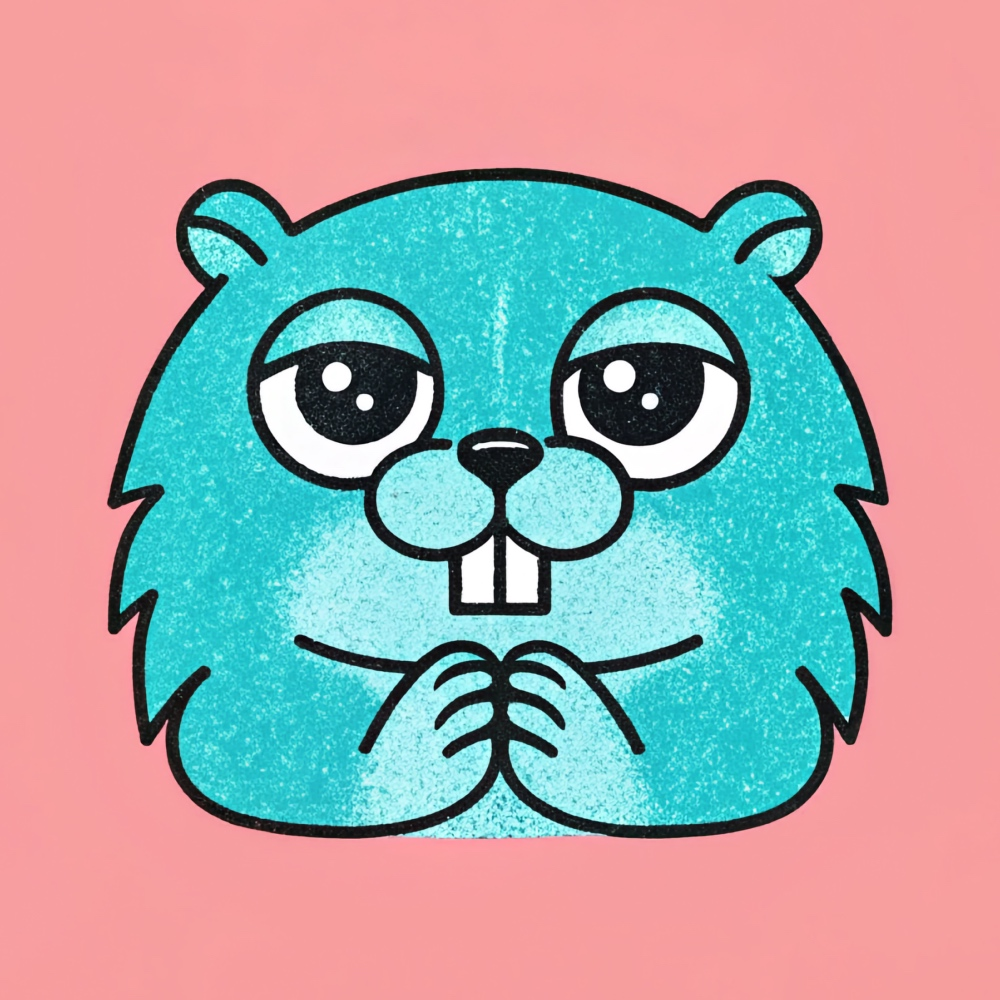

# GAI for OpenAI

[GAI](https://github.com/maragudk/gai) client for [OpenAI](https://openai.com) models and compatible APIs, such as [LlamaCPP](https://github.com/ggml-org/llama.cpp).

Made with ✨sparkles✨ by [maragu](https://www.maragu.dev/).

Does your company depend on this project? [Contact me at markus@maragu.dk](mailto:markus@maragu.dk?Subject=Supporting%20your%20project) to discuss options for a one-time or recurring invoice to ensure its continued thriving.
